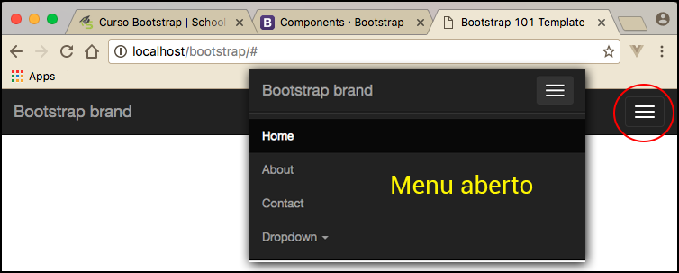

# Criar um menu de navegação

Antes de qualquer outra funcionalidade do framework, iremos ensinar a criar a barra de navegação, que geralmente é um dos primeiro itens de uma aplicação.

Vamos mostrar onde encontrar este recurso na documentação do Bootstrap. Veja imagem abaixo:


Neste setor do site temos um exemplo de navbar padrão, porém ela não é fixada na tela conforme a tela é rolada. Em nosso exemplo iremos criar a navbar fixa, portanto se o usuário rolar a tela, o menu ficará no topo sempre, acompanhando o conteúdo da página.

A documentação ensina como colocar logomarca no menu, inserir campos de formulários entre outros recursos, basta ler com calma e procurar o que está precisando.

Veja o código completo da navbar do nosso projeto, logo abaixo iremos comentar:

```html
<header>
    <nav class="navbar navbar-inverse navbar-fixed-top">
        <div class="container">
            <div class="navbar-header">
                <button type="button" class="navbar-toggle collapsed" data-toggle="collapse" data-target="#navbarCollapse" aria-expanded="false">
                    <span class="sr-only">Toggle navigation</span>
                    <span class="icon-bar"></span>
                    <span class="icon-bar"></span>
                    <span class="icon-bar"></span>
                </button>
                <a href="#" class="navbar-brand">Bootstrap brand</a>
            </div>
            <div id="navbarCollapse" class="navbar-collapse collapse">
                <ul class="nav navbar-nav navbar-right">
                    <li class="active"><a href="#">Home</a></li>
                    <li><a href="#">About</a></li>
                    <li><a href="#">Contact</a></li>
                    <li class="dropdown">
                        <a href="#" class="dropdown-toggle" data-toggle="dropdown" role="button" aria-haspopup="true" aria-expanded="false">Dropdown <span class="caret"></span></a>
                        <ul class="dropdown-menu">
                            <li class="dropdown-header">Title 1</li>
                            <li><a href="#">Action</a></li>
                            <li><a href="#">Another action</a></li>
                            <li><a href="#">Something else here</a></li>
                            <li role="separator" class="divider"></li>
                            <li class="dropdown-header">Title 2</li>
                            <li><a href="#">Separated link</a></li>
                            <li role="separator" class="divider"></li>
                            <li><a href="#">One more separated link</a></li>
                        </ul>
                    </li>
                </ul>
            </div>
        </div>
    </nav>
</header>
```

# Comentando estrutura e classes

Criamos a tag **header** para englobar o menu inteiro. Depois inserimos a tag **nav** com as seguintes classes:

Classe | Função
--------- | ----------
navbar | Tem a função identificar o menu e estilizar
navbar\-inverse | Inverte as cores principais da aplicação. A cor principal padrão é clara, quando utilizamos o inverse ele trabalha com o menu escuro e inverte as cores das fontes também.
navbar\-fixed-top | Responsável por fixar o menu ao topo, mesmo que o usuário role a tela para baixo o menu é fixado ao topo da página.

Depois adicionamos uma div com a classe **container**, que server para centralizar um pouco mais o conteúdo, adicionando margens. Existe também a classe **container-fluid** que libera as margens do container para que o layout seja fluído e pegue a tela inteira.

Logo após temos o navbar-header:

```html
<div class="navbar-header">
    <button type="button" class="navbar-toggle collapsed" data-toggle="collapse" data-target="#navbarCollapse" aria-expanded="false">
        <span class="sr-only">Toggle navigation</span>
        <span class="icon-bar"></span>
        <span class="icon-bar"></span>
        <span class="icon-bar"></span>
    </button>
    <a href="#" class="navbar-brand">Bootstrap brand</a>
</div>
```

Este botão possui as classes **navbar-toggle e collapsed** que são responsáveis por esconder o botão em dispositivos maiores. Ele deve ser mostrado, de outra forma, em dispositivos menores. Possui também atributos para javascript **data-toggle e data-target**. O data-toggle serve para o javascript disparar um evento para mostrar o menu, em dispositivos menores, e o data-target serve para fazer a identificação do menu correto a ser mostrado, ao clicar no botão.

Reparem que o atributo **id**, da div que engloba o menu acima, tem o mesmo valor do atributo data-target informado no botão. Você poderia utilizar o data-target como sendo uma classe também, basta que a div do menu tenha a mesma classe. Vejam nos fragmentos de código abaixo:

```html
// Data target do botão
<button type="button" class="navbar-toggle collapsed" data-toggle="collapse" data-target="#navbarCollapse" aria-expanded="false">
</button>

// ID da div que engloba o menu
<div id="navbarCollapse" class="navbar-collapse collapse">
</div>
```

Ambos devem ter o mesmo valor, isso assegura que ao clicar no botão do menu o código irá mostrar o menu que tem o mesmo ID, senão poderia mostrar algum outro menu existente na página. Então você pode criar o data-target que quiser, basta que coloque o mesmo valor no id.

Veja imagem do botão em layouts menores:



Depois do navbar-header, temos o menu finalmente.

```html
<div id="navbarCollapse" class="navbar-collapse collapse">
    <ul class="nav navbar-nav navbar-right">
        <li class="active"><a href="#">Home</a></li>
        <li><a href="#">About</a></li>
        <li><a href="#">Contact</a></li>
        <li class="dropdown">
            <a href="#" class="dropdown-toggle" data-toggle="dropdown" role="button" aria-haspopup="true" aria-expanded="false">Dropdown <span class="caret"></span></a>
            <ul class="dropdown-menu">
                <li class="dropdown-header">Title 1</li>
                <li><a href="#">Action</a></li>
                <li><a href="#">Another action</a></li>
                <li><a href="#">Something else here</a></li>
                <li role="separator" class="divider"></li>
                <li class="dropdown-header">Title 2</li>
                <li><a href="#">Separated link</a></li>
                <li role="separator" class="divider"></li>
                <li><a href="#">One more separated link</a></li>
            </ul>
        </li>
    </ul>
</div>
```

Reparem que temos uma estrutura html normal de menu, porém temos as classes que fazem toda a diferença.

Classe | Função
--------- | ----------
nav e navbar\-nav | Identificar e estilizar o menu.
navbar\-right | Deslocar menu para o lado direito, caso não coloque o menu sempre ficará para esquerda, como padrão.
active | Destacar a página atual no menu, para mostrar ao usuário qual página ele se encontra de uma forma visual.
dropdown | Informar que existe uma estrutura de submenus e fazer toda estilização. Reparem que dentro da classe dropdown você pode ter títulos e separadores tudo pronto para você, só basta utilizar.

Falamos um pouco sobre as classes, caso precise saber mais, você pode consultar na documentação que encontrará tudo sobre as mesmas. E todos os recursos possuem exemplos práticos.

# Conclusão

O objetivo deste módulo era implementar um menu de navegação, inclusive deixar ele ativo para dispositivos móveis. Nós utilizamos somente informações contidas na documentação do Bootstrap então, tudo que adicionamos você pode encontrar e tirar maiores dúvidas no site.

Faça mais testes, retire classes e inclua novamente, para ir vendo qual o papel de cada uma. Adicione mais elementos ao menu e faça testes também diminuindo o tamanho do seu browser para conferir as modificações nas versões mobiles.

Lembre-se! Quanto mais praticar, maior vai ser sua fixação sobre o conteúdo e menus são itens fundamentais em aplicações web. E o mais importante é saber que sua aplicação, desta forma, está servindo um menu para todos os tipos de dispositivos e seu trabalho foi praticamente zero. O Bootstrap trouxe tudo pronto para você.