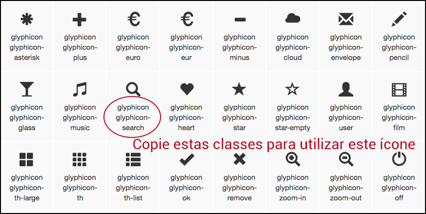

# Ícones

Outro recurso, muito interessante e útil, que o Bootstrap disponibiliza, são os ícones. 
Ter ícones a disposição faz com que ganhemos muito tempo e consigamos estilizar, muito mais, a aplicação.

No primeiro capítulo, quando instalamos o Bootstrap, falamos de uma pasta chamada **fonts**. Os ícones são todos tratados como fontes. Isso é ótimo porque podemos alterar o tamanho e as cores dos ícones, de forma muito fácil, utilizando CSS, apenas.

Acessando o link de **components**, no site do Bootstrap, vocês verão os ícones em primeiro lugar, na documentação.



Observem, nos exemplos abaixo, como é fácil utilizar ícones. 
Basta que olhem no site as opções e copiem as classes referentes a cada um deles, como mostra a imagem acima.

# Inserindo os ícones

```html
<main>
    <section>
        <div class="container">
            <div class="row text-center">
                <h1>Glyph icons</h1>
                <p><span class="glyphicon glyphicon-search" aria-hidden="true"></span></p>
                <p><span class="glyphicon glyphicon-education" aria-hidden="true" style="font-size: 40px;"></span></p>
                <p><span class="glyphicon glyphicon-user" aria-hidden="true" style="font-size: 40px; color: blue;"></span></p>
                <p><span class="glyphicon glyphicon-user text-danger" aria-hidden="true" style="font-size: 40px;"></span></p>
                <p><button class="btn btn-success glyphicon glyphicon-ok " aria-hidden="true" style="font-size: 40px;"></button></p>
            </div>
        </div>
    </section>
</main>
```

Acima, mostramos como utilizar ícones com a tag span e também com a tag button. Vocês podem ver que são maneiras muito parecidas e, em ambas, vocês podem utilizar o atributo **style**, para formatar da maneira que quiserem. 
Vocês podem alterar cores e tamanhos, facilmente.

Demos um exemplo de como alterar a cor, do ícone, utilizando classes do próprio Bootstrap. 

Exemplo: **text-danger**.

Vale lembrar que, utilizamos o atributo **aria-hidden="true"**, porque estamos utilizando uma tag span vazia. 
O span possui somente as classes e, o objetivo dele é produzir um ícone, apenas. Logo, não existe valor entre as tags de abertura e fechamento. Por isso o Bootstrap nos orienta a utilizar este atributo.