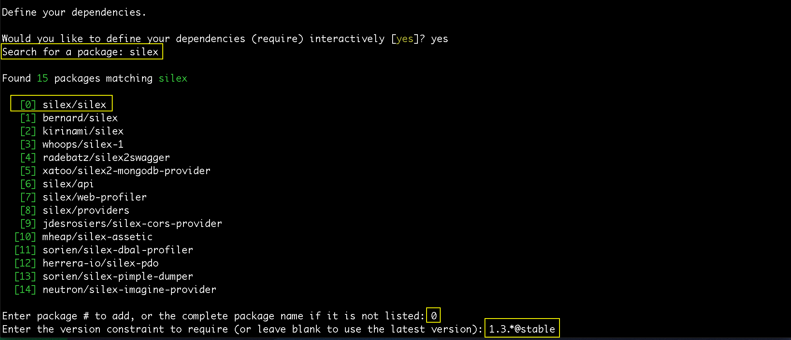

# Configurando o Composer Json

Vamos ensinar a instalar o composer em sua máquina. Primeiramente acesse o site <https://getcomposer.org/>


Depois de acessar vá até a parte de **download** ou acesso o link diretamente <https://getcomposer.org/download/>.

Acessando esta página você vai ter duas opções de instalação: via curl ou php.

Curl:

`$ curl -sS https://getcomposer.org/installer | php`

PHP:

`$ php -r "readfile('https://getcomposer.org/installer');" | php `

Caso ainda queira fazer da maneira mais atual você pode seguir os comandos abaixo:

`$ php -r "copy('https://getcomposer.org/installer', 'composer-setup.php');"`
`$ php -r "if (hash_file('SHA384', 'composer-setup.php') === '55d6ead61b29c7bdee5cccfb50076874187bd9f21f65d8991d46ec5cc90518f447387fb9f76ebae1fbbacf329e583e30') { echo 'Installer verified'; } else { echo 'Installer corrupt'; unlink('composer-setup.php'); } echo PHP_EOL;"`
`$ php composer-setup.php`
`$ php -r "unlink('composer-setup.php');"`

Vale a pena lembrar que estes passos de instalação deverão ser feitos dentro da pasta raiz do seu projeto. Porque você irá rodar os comando a seguir dentro da pasta do projeto, portanto o arquivo composer.phar deverá estar no mesmo local.

# Trabalhando com arquivo composer.phar

Depois de executar os passos de instalação, você deverá conferir se existe realmente o arquivo composer.phar na pasta raiz do seu projeto. Caso exista é porque a instalação foi feita corretamente e você pode rodar o comando: `$ php composer.phar`. Digitando este comando, em seu terminal, você deverá obter, como resultado, uma lista de todos os comandos do Composer.

## Criando arquivo composer.json

Você pode criar o arquivo manualmente, caso saiba a estrutura ou pode criar utilizando o terminal com o comando específico do Composer. Na documentação do Composer, no site citado acima, tem muitos exemplos para que você possa seguir. Então não deixe de olhar.

Neste conteúdo iremos exemplificar utilizando o terminal. Rode o comando abaixo:

`$ php composer.phar init`

Este comando lhe fará algumas perguntas, antes da criação do arquivo de configuração.

1. Qual o nome do pacote ou da sua aplicação.
    * Colocaremos **son/phpcoursecomp**
2. Descrição
    * Colocaremos **Composer course in SON**
3. Autor
    * O Composer já reconhece o usuário do computador, então pega automaticamente, caso queira alterar você pode, mas iremos deixar o padrão.
4. Estabilidade mínima
    * Nós colocaremos **dev** (desenvolvimento)
5. Tipo do pacote
    * Você pode colocar **Library** ou o tipo da sua aplicação. Nós deixaremos em branco.
6. Licença
    * Você pode inserir licença caso necessite, mas nós deixaremos em branco também.
7. Dependências
    * Vamos digitar **yes** e o composer irá dar a opção de pesquisar por pacotes.

Para exemplificar iremos instalar duas bibliotecas: silex e doctrine.

Você pode colocar colocar o nome principal da biblioteca para que o Composer faça uma busca no repositório. Caso tenha alguma dúvida de versão da biblioteca, você pode pesquisar no próprio site do Composer em **Browse Packages**. O link para pesquisa é: <https://packagist.org/>.

Neste setor do site você pode pesquisar as diversas bibliotecas existentes e suas versões para informar ao Composer. Para a biblioteca silex verificamos a versão estável como sendo **1.3.5** e para o doctrine a versão **2.5.4**. Estamos falando das versões atuais no momento em que este conteúdo foi produzido, você pode estar lendo este conteúdo e as versões já estarem mais avançadas.

Ao pesquisar no Composer ele trará uma lista de itens relacionados. Você deverá informar o número do índice relacionado ao pacote que desejar instalar. Depois disso será solicitado a versão que você queira instalar. Iremos informar as versões da maneira abaixo:

`1.3*@stable` e `2.5*@stable`

Desta maneira ele pega a última versão que existir e que seja a versão mais estável da biblioteca.



Assim que adicionar todas as dependências do projeto, de um enter sem nenhum conteúdo para que ele entenda que não existem mais dependências. Assim ele irá passar para as dependências de desenvolvimento.

Dependências de desenvolvimento quer dizer que você utilizará estas bibliotecas apenas para desenvolver, quando for para o ambiente de produção, por exemplo, seu projeto não irá depender delas. É o caso do PHPUnit que utilizamos para testes. Esta biblioteca não tem necessidade de estar no ambiente de produção, porque não será utilizada, então adicionamos somente nas dependência de desenvolvimento.

Para desenvolvimento adicionaremos apenas o **PHPunit** e a versão **5.1*@stable**.

Do mesmo modo que nas dependências você deve dar um enter em branco assim que terminar de adicionar as dependências de desenvolvimento. Após terminar as adições de dependências o Composer irá perguntar se está tudo ok, dando uma prévia de como estará o seu arquivo de configuração. Em caso de estar tudo em ordem digite **yes** e o arquivo de configuração **composer.json** será criado com sucesso.

Veja o código gerado pelo comando init do Composer:

```json
{
    "name": "son/phpcoursecomp",
    "description": "Composer course in SON",
    "require": {
        "silex/silex": "1.3*@stable",
        "doctrine/dbal": "2.5*@stable"
    },
    "require-dev": {
        "phpunit/phpunit": "5.1*@stable"
    },
    "authors": [
        {
            "name": "Thiago Valls",
            "email": "thiago@schoolofnet.com"
        }
    ],
    "minimum-stability": "dev"
}
```

No próximo conteúdo iremos adicionar a configuração de autoload e também já rodaremos o comando de instalação do Composer. Mas a primeira etapa você já concluiu, aprendendo a configurar um arquivo composer.json. Lembrando que você pode criar este arquivo via terminal, do jeito que fizemos, ou você pode criar ele manualmente.