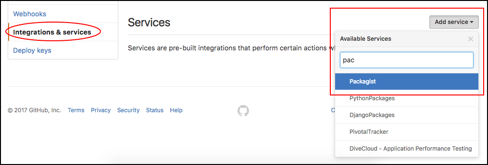

# Configurando Packagist Github

Depois que você subir sua biblioteca para o gitbub você vai precisar fazer um cadastro no site <https://packagist.org/>. Depois que fizer o cadastro e estiver logado, você pode ir até o menu **Submit** e inserir o link do projeto no github para teste.

Biblioteca no github:

# Fazendo o Submit no Packagist

Reparem na imagem abaixo que tivemos muitos nomes parecidos, porque muitos alunos já fizeram este teste até a criação deste conteúdo, mas se o site permitir que você faça o **submit** quer dizer que está tudo ok com o seu pacote.

Após o processo de checagem vem o submit, depois que você der um submit quer dizer que a sua biblioteca já faz parte dos pacotes disponíveis no composer.

Depois que você clica em submit você terá a seguinte mensagem:

Isso ocorre porque ainda não está configurada a atualização automática. Falando em outras palavras, sempre que fizermos uma atualização na biblioteca e subirmos para o Github, teremos que ir até o packagist e atualizar manualmente, clicando no botão Update, que está em verde.

Para que a atualização seja feita automaticamente siga os seguintes passos.

1. Clique em **GitHub Service Hook** que foi marcado na imagem acima.
2. Depois abra outra aba e vá até seu repositório no Github. Depois cliquem em **settings** do seu repositório.

Na aba **Integrations & Services**, do lado esquerdo, você terá a opção de adicionar serviços. Veja imagem abaixo:

Quando selecionar a opção **packagist** ira recarregar a página e irá pedir o token, que deve ser gerado la no link <https://packagist.org/profile/>. Veja imagem abaixo:

Depois de gerado você deve voltar no github e colar no campo solicitado. Veja imagem:

Depois que adicionar o token você deve editar o seu serviço novamente, porque ele ainda não estará ativo, e depois de clicar em editar você deve clicar no **Test service**. Você deverá obter a mensagem abaixo:

Assim que o teste rodar você pode ir até o site do packagist e a mensagem de erro, na sua biblioteca, deve desaparecer. Veja a imagem abaixo:

# Pesquisando no site Packagist

Depois de um tempo você já pode pesquisar sua biblioteca no site que você já terá acesso a ele e consequentemente você podera instalar via composer no terminal.

# Conclusão

Próximo passo será criar um novo projeto e incluir a biblioteca que criamos, e adicionamos no packagist, como dependência do projeto. Depois de instalar vamos testar a classe criada pra ver se ela está funcionando corretamente também.

Faça todo este procedimento criando uma biblioteca com seus dados e colocando no seu github. Depois insira esta biblioteca no packagist também, para treinar e fixar o conteúdo. Crie o hábito de criar pequenos códigos e disponibilize para a comunidade, isso fará com que o PHP cresça cada vez mais.