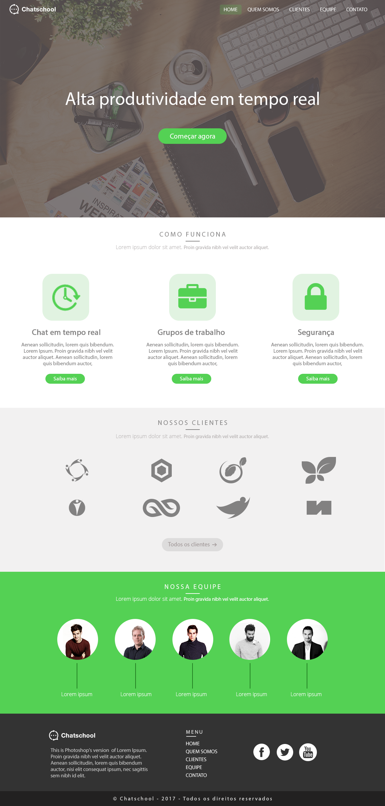

# Marcando as principais sessões do nosso projeto

Neste módulo nós criaremos a primeira estrutura do nosso projeto final.

Veja a página inicial do nosso projeto final:



Nosso projeto terá outras páginas como: **quem somos**, **equipe**, **contato**.

Analisando a nossa página inicial podemos dizer que ela possui 3 blocos: cabeçalho, conteúdo e rodapé.

**Cabeçalho:** Se trata da primeira imagem, onde está o logo e o menu do site.

**Conteúdo:** Se trata dos 3 blocos que compõem o miolo do nosso site, ou seja, a parte do conteúdo interno mesmo. Você pode diferenciar pelas cores. O primeiro bloco é branco, o segundo é cinza e o terceiro é verde. Ou pode identificar por nomes, onde o primeiro é **Como Funciona**, o segundo é **Nossos Clientes** e o terceiro é **Nossa Equipe**.

**Rodapé:** Se trata da última seção do nosso site, que está na cor preta. Você pode ver na imagem facilmente esta divisão. No rodapé temos informações sobre o desenvolvedor, sobre o app e as redes sociais.

Depois de falarmos sobre a estrutura principal do nosso layout vamos para a prática. Marcaremos os três elementos principais.

```
<!DOCTYPE html>
<html lang="en">
<head>
    <meta charset="UTF-8">
    <title>Title</title>
</head>
<body>
    <header id="header">Cabeçalho</header>
    <main>
        <section id="how-it-works">Como Funciona</section>
        <section id="customers">Nossos Clientes</section>
        <section id="team">Nosso Time</section>
    </main>
    <footer id="footer">Rodapé</footer>
</body>
</html>
```

Percebam que além das tags nós adicionamos o atributo **ID**, para cada tag. O atributo id deve ser único, não podendo ter repetição.

Para o cabeçalho utilizamos a tag **header**, do html5, para o conteúdo principal utilizamos a tag **main** e para o rodapé utilizamos o **footer**.

Dentro do conteúdo principal temos mais três seções, que dividimos com as tags **section**.

É muito importante esta estruturação porque estamos trabalhando de forma semântica e os mecanismos de buscas irão interpretar o nosso site da melhor forma possível. Isso lhe da vantagem em relação a outros sites que não trabalhamos de forma correta.

Se você for até o browser e analisar o arquivo index.html, você vai ver que temos a estrutura montada, porém está sem estilização nenhuma. Por enquanto era este resultado que esperávamos mesmo. Nos próximos módulos começaremos a inserir o CSS e o site começará a ter estilização até chegarmos aos projeto final.