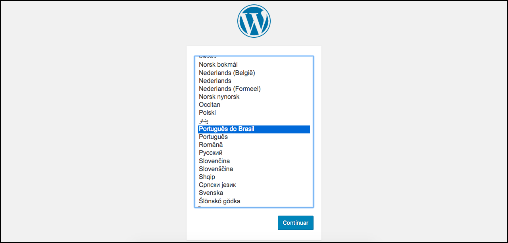
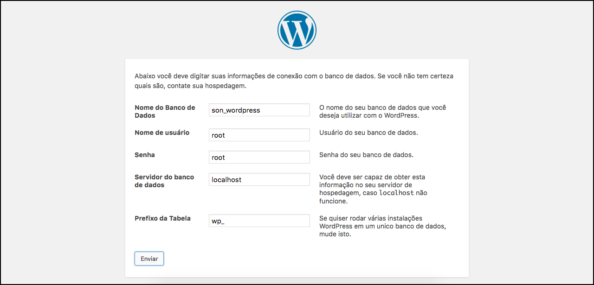

# Instalação do wordpress

Geraremos a instalação do Wordpress, em nosso sistema operacional. Vamos aos requisitos, mínimos, recomendados para a instalação.

* O Wordpress já roda com o PHP 7
* MySQL 5.6 ou superior / MariaDB 10.0 ou superior

É possível que, quando estiverem lendo este conteúdo, as versões já estejam superiores. Este dados foram consultados no momento da criação deste conteúdo.

Se quisermos rodar com requisitos mínimos, podemos utilizar o PHP 5.2 e o MySQL 5. O Wordpress recomenda a utilização das versões acima. Com estas versões ele rodará, tranquilamente.

O Wordpress, por ser uma ferramenta muito utilizada, dificilmente exigirá as últimas versões das tecnologias envolvidas. Ele sempre estará atualizado, mas manterá algumas estruturas, para que sejam rodadas nas versões mais antigas.

Para este conteúdo, será utilizado o PHP 5.6, mas se tiverem a versão 5.5, fiquem tranquilos, que conseguirão acompanhar. É exigido, pelo menos, a versão 5.4, porque rodaremos o wordpress em cima do servidor embutido do PHP. 
Vocês precisarão do MySQL 5.6, também.

Estamos partindo do princípio que, quem está fazendo este curso, já tenha conhecimentos, básicos, de PHP e MySQL. Por isso, não entraremos em detalhes destas ferramentas.

No caso do Windows, precisaremos que instalem o **Git Bash**. Esta ferramenta é  um terminal que simula um ambiente UNIX. 
Instalaremos o Wordpress, via curl, e precisaremos do Git Bash. Não aconselhamos trabalharem sem git bash no Windows, porque o cmd, nativo do Sistema Operacional, é muito ruim.

# Instalando Wordpress

Primeiro passo será abrir o terminal, da máquina. Lembrem-se que, se estiverem utilizando Windows, deverão utilizar o git bash.

Nós utilizaremos o **curl**, para fazer o download do Wordpress. Se não tiverem esta ferramenta instalada, deverão instalá-la. Se estiverem utilizando Linux, podem rodar o comando abaixo:

`$ sudo apt-get install curl`

Desta forma, já terão a ferramenta configurada. Podem trabalhar com **wget** no MAC, caso prefiram.

O curl é um comando de terminal que possibilita fazer uma requisição http para uma url. Se tiver um arquivo disponível para download, ele executa. 
Lembrando que, se estiverem utilizando o Windows e não instalarem o git bash, não conseguirão utilizar o curl.

Vejam o comando que deverão rodar, dentro da pasta que estará a instalação do seu Wordpress.

`curl -O https://wordpress.org/latest.zip`

Assim, terão o download do arquivo zip. Em seguida, basta rodarem os seguintes comandos:

```
unzip latest.zip
rm latest.zip
```

O unzip para extrair os arquivos e o rm para remover o arquivo zip, que não precisarão mais. 
Com isso, terão uma pasta chamada **wordpress**, com todos os arquivos do CMS.

Após estes procedimentos, rodaremos o servidor embutido do PHP, dentro da pasta wordpress. Lembrando que, vocês podem renomear esta pasta, caso queiram.

`php -S localhost:8000`

Acessem o endereço **http://localhost:8000** e deverá conter a imagem abaixo:



Deveremos selecionar a linguagem que queremos instalar o Wordpress e continuar.

Em seguida, ele informará que precisam fazer a configuração de banco de dados, para criação do arquivo wp-config.php, basta avançar.

Na próxima tela, terão que informar os dados de banco de dados, para que o Wordpress possa conectar e instalar as tabelas de banco de dados da sua estrutura padrão.

### Criando um banco por terminal

Rodem os comandos abaixo:

```
# Acessa o mysql com usuário(-u) e senha(-p)
mysql -uroot -proot

# Comando para criar um banco de dados
create database son_wordpress;

# Comando para finalizar a execução do MySQL
exit
```

Após criarem o banco, deverão informar os dados referentes a ele, na tela de instalação do wordpress.

O host, na maioria dos casos, é localhost, caso seja diferente, vocês deverão saber.

Na maioria dos casos, o usuário do banco é **root** e a senha também. Durante a instalação do MySQL, vocês podem ter definido outra senha. Basta colocar o usuário e a senha, corretos, para conseguirem prosseguir a instalação.

Existe a opção de alterar o prefixo das tabelas do banco de dados, que, por padrão, vem **wp_**.



O próximo passo será definirem um título para o site e o usuário e a senha do painel administrativo, que vocês podem preencher da maneira que acharem melhor.

Caso utilizem uma senha fraca, deverão marcar que estão cientes, para que consigam prosseguir.

Depois de um tempo, teremos a instalação do Wordpress concluída e seremos redirecionados para o painel administrativo.

Por último, vocês devem visitar o site para checarem se está tudo funcionando. Acessem **http://localhost:8000**.

Caso seja necessário, repitam o procedimento, instalando outros sites, até fixarem bem o conteúdo. 
A instalação é muito simples, mas é bom praticar.