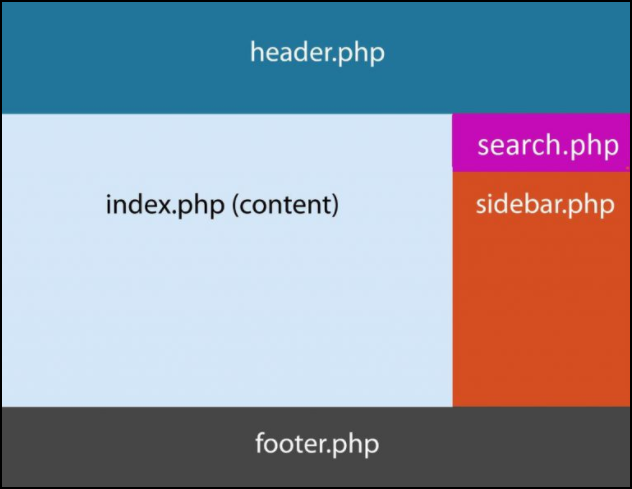

# Anatomia de um tema

Para podermos desenvolver um tema, nós temos que entender a estrutura do mesmo. Temos que saber como este tema será mostrado ao usuário.

Temos que entender a **anatomia** do tema que será criado e temos uma imagem, no próprio site do wordpress, que explica o que queremos lhe mostrar. Veja imagem abaixo:

Quando você ver um site, desenvolvido em Wordpress, ele será subdividido em: header, footer, content, seach e sidebars. Nós mostramos o conteúdo com o index, mas podemos também mostrar com outros arquivos, o exemplo não é uma regra.

Podemos ter mais do que uma sidebar em uma mesma estrutura.

# Criando arquivos PHP referentes a anatomia

Sabendo da anatomia basta que comece a criar os arquivos com o mesmo nome da imagem.

* header.php
* index.php
* footer.php
* search.php
* sidebar.php

Além destes arquivos, citados acima, existem outro arquivos que são reservador para o wordpress, mas falaremos mais para frente.

O Wordpress irá reconhecer estes arquivos, porque fazem parte da estrutura defindida por ele. Apesar de existir uma estrutura pré-definida, você tem toda liberdade para criar a estrutura de pasta que quiser em seu tema, e de acordo com a regra de negócio que existir, em seu site, você vai carregando estes arquivos. Somente o index.php deve estar na raiz.

Você pode, inclusive, copiar a mesma estrutura criada nos temas padrões do Wordpress, caso tenha alguma dúvida, mas o importante é você saber que existe uma anatomia, existem os arquivos corretos a serem criados e a hora correta a serem chamados.

Nós iremos criar cada parte desta anatomia, presente na imagem acima, para que você possa entender melhor como cada uma delas funcionam dentro do Wordpress.