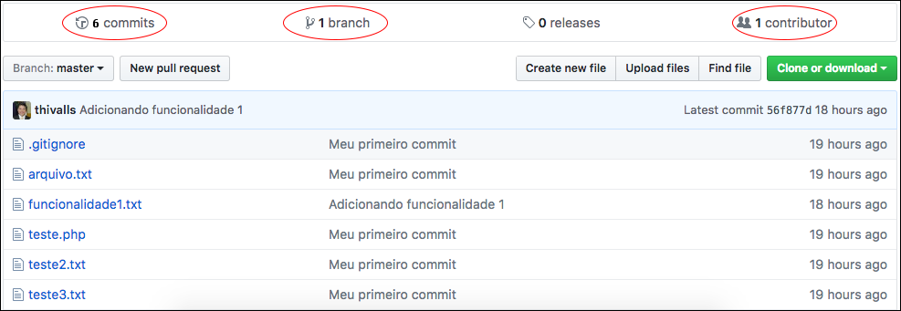

# Primeiro push

Neste módulo você irá aprender a realizar o primeiro push.

Antes de sair realizando o procedimento e ficar falando dos comandos, vamos explicar o que é o push.

O push, em inglês, é "empurrar". Para o nosso cenário ele significa praticamente isso mesmo, porque quando você tem o seu repositório local e quer enviar os os commits para um repositório online, para centralizar o conteúdo. Você pode subir seus arquivos para um repositório online por segurança ou até mesmo para compartilhar seu código com outros desenvolvedores.

Então, para que você consiga trabalhar com o **git push**, você precisa adicionar um repositório remoto. Você adiciona esta configuração, informando o endereço do repositório online, para que toda vez que efetuar um push o Git saiba para onde enviar os arquivos.

Para criar este link e configurar o repositório local temos o seguinte comando:

`$ git remote add origin https://github.com/schoolofnetcom/git-code-education.git`

Você pode ver que o comando é bem intuitivo, a única particularidade é o **origin**. Muitos pensam que esta palavra faz parte do comando, mas se trata apenas de um apelido que você dá para o seu repositório remoto. Sabendo disso você poderia utilizar qualquer outro nome, mas não é muito recomendado a alteração, uma vez que é uma convenção e a grande maioria utiliza o origin.

Depois que rodar o comando, com o endereço do seu repositório online, você já pode enviar os arquivos para o repositório online com o comando push.

Para você saber onde o Git guarda estas configurações nós iremos informar o local de armazenamento.

Abra o arquivo chamado config, que está dentro da pasta oculta do Git, em seu repositório local.

`$ vim .git/config`

```
[core]
        repositoryformatversion = 0
        filemode = true
        bare = false
        logallrefupdates = true
        ignorecase = true
        precomposeunicode = true
[remote "origin"]
        url = https://github.com/schoolofnetcom/git-code-education.git
        fetch = +refs/heads/\*:refs/remotes/origin/*
```

Vejam eu neste arquivo ele guarda as informações necessárias para o repositório remoto. Todas as configurações, que você fizer no seu repositório, ficará neste arquivo de configuração.

Agora que já configuramos vamos enviar os nossos arquivos para o repositório online.

`$ git push origin master`

O comando diz: "empurre o meu branch master para o repositório origin". Isso significa que estamos subindo todos os arquivos e commits para o repositório online.

```
Counting objects: 7, done.
Delta compression using up to 4 threads.
Compressing objects: 100% (4/4), done.
Writing objects: 100% (7/7), 560 bytes | 0 bytes/s, done.
Total 7 (delta 1), reused 0 (delta 0)
remote: Resolving deltas: 100% (1/1), done.
To https://github.com/schoolofnetcom/git-code-education.git
 * [new branch]      master -> master
```

Vejam que no resultado do comando o Git informa que foi criado um novo branch, chamado **master**, no repositório online. E depois ele informa que está enviando do branch master local para o branch master online.

Depois de enviar acesse o seu repositório online para verificar os arquivos e informações.



Percebam que todas as informações de commits e branchs foram enviadas, juntamente com o nosso push. Isso quer dizer que temos uma cópia do nosso repositório local em um repositório remoto, centralizando meu projeto.