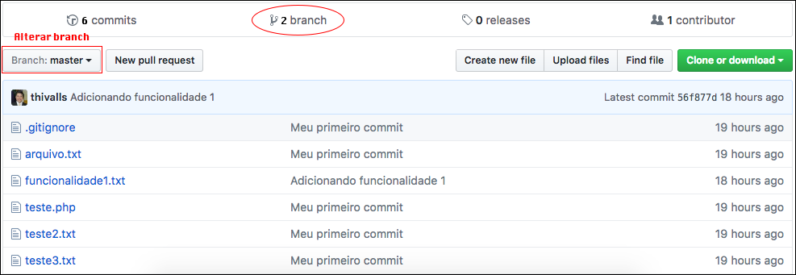

# Dando push em outro branch

Agora que já fizemos o push normal, enviando o branch master para o repositório remoto, vamos ensinar como enviar um novo branch.

Nós temos, em nosso exemplo, um branch chamado **funcionalidade1**. O procedimento é acessar este branch e depois dar um push deste repositório para o Github.

`$ git checkout funcionalidade1`

Depois de acessar rode o push.

`$ git push origin funcionalidade1`

Depois de rodar o push teremos a seguinte mensagem do Git.

```
Total 0 (delta 0), reused 0 (delta 0)
To https://github.com/schoolofnetcom/git-code-education.git
 * [new branch]      funcionalidade1 -> funcionalidade1
```

Vejam que ele informou que foi enviado de funcionalidade1 local para funcionalidade1 remoto. Quando não existe o branch ele cria automaticamente, então você poderia colocar outro nome no repositório remoto, caso quisesse, mas não é muito indicado, para não haver confusão.

Depois de ter enviado vamos conferir se realmente o branch foi criado remotamente.



Na imagem nós mostramos os dois branchs criados e também onde você pode alterar de branch online.

Agora que você já sabe como enviar seus branchs para o repositório remoto vamos dar continuidade ao conteúdo.