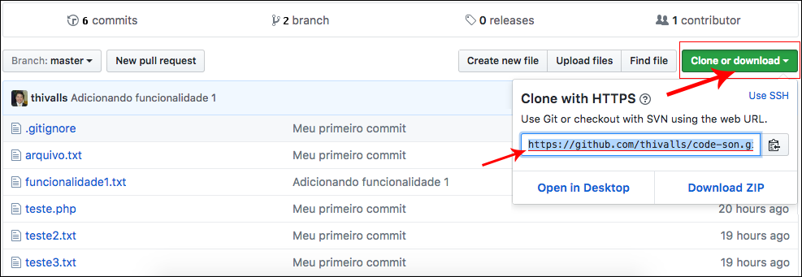

# Fazendo clone

Neste módulo mostraremos como que fazemos um clone de um repositório e para que ser um clone na realidade.

Vamos supor que você, por engano, apagou o repositório local, ou está em outro computador e precisa daquele repositório. Para exemplificar esta situação nós apagaremos a pasta **aulagit** que criamos como exemplo.

`$ rm -rf aulagit`

Desta forma não existe mais nenhum arquivo de nosso repositório em nossa máquina. Para termos novamente precisaremos baixar do repositório remoto e para isto que serve o comando **clone**.

Para conseguir rodar o comando precisamos do link de clonagem, que é fornecido pelo próprio Github.



Todo repositório terá um link para clonagem e você pode encontrar na imagem acima.

Existem dois modos de fazer a clonagem:

1. Utilizando https
2. Utilizando ssh

No repositório remoto você terá o link para ambos. Com estes dados você pode escolher qual formato você prefere, mas, na grande maioria das vezes, o mais utilizado é o protocolo **https** porque o ssh nem sempre está configurado, ou as vezes pode estar bloqueado pelo proxy.

`$ git clone https://github.com/schoolofnetcom/git-code-education.git` ou `$ git clone https://github.com/schoolofnetcom/git-code-education.git aulagit`

Percebam que colocamos dois exemplos: um com parâmetro e outro sem parâmetro depois da URL. Este parâmetro é para dar um nome à pasta da sua clonagem, caso não passe nada você terá o mesmo nome do repositório.

Para clonar o repositório nós utilizamos o primeiro comando, sem parâmetro, e tivemos a seguinte mensagem:

```
Cloning into 'git-code-education'...
remote: Counting objects: 7, done.
remote: Compressing objects: 100% (3/3), done.
remote: Total 7 (delta 1), reused 7 (delta 1), pack-reused 0
Unpacking objects: 100% (7/7), done.
Checking connectivity... done.
```

Clonar um repositório é relativamente fácil, mas se você rodar o comando **git branch** você verá que, em sua clonagem, só veio o branch master. Porém existe um outro branch que deveria fazer parte do seu clone, então agora que vem a sacada.

Quando você roda o comando git branch, você sempre terá somente os branchs que estiverem localmente, mas você pode ver os branchs remotos também, basta acrescentar o parâmetro **-a** em seu comando, neste caso você terá os branchs locais e remotos.

`$ git branch -a`

```
* master
  remotes/origin/HEAD -> origin/master
  remotes/origin/funcionalidade1
  remotes/origin/master
```

Percebam que ele mostra os branchs locais e os remotos. Sabendo destes dados podemos fazer a ligação de um branch local com um branch remoto.

Primeiro você deve criar o branch normalmente em seu repositório local, como você já aprendeu, só que o comando deve receber um parâmetro a mais, que é qual branch você deseja ligar com o repositório remoto. Veja o comando:

`$ git checkout -b funcionalidade1 origin/funcionalidade1`

Vejam que o comando retorna a mensagem dizendo que o branch foi criado de acordo com o branch remoto.

```
Branch funcionalidade1 set up to track remote branch funcionalidade1 from origin.
Switched to a new branch 'funcionalidade1'
```

Se você rodar um `$ ls` você já vai estar listando os arquivos que estiverem dentro do branch funcionalidade1, mas não necessariamente os arquivos do branch remoto funcionalidade1 estarão dentro desta pasta. Mas temos como garantir que todos os arquivos do branch remoto estejam no branch local rodando o seguinte comando:

`$ git pull`

Este comando verifica se todos os arquivos já estão sincronizados, se não estiver ele irá atualizar para você.

Agora nós temos dois branchs locais e mais dois branchs remotos. Para ter certeza destas quantidades e informações iremos rodar novamente o comando **git branch -a**.

`$ git branch -a`

E teremos o seguinte resultado:

```
* funcionalidade1
  master
  remotes/origin/HEAD -> origin/master
  remotes/origin/funcionalidade1
  remotes/origin/master
```

Podemos concluir que existem os mesmos branchs locais no repositório remoto e o comando ainda trás a informação de que o branch remoto principal é o master, porque ele fala que o **HEAD** está apontando para o **origin/master**.

Agora você já consegue clonar completamente qualquer repositório do Github.