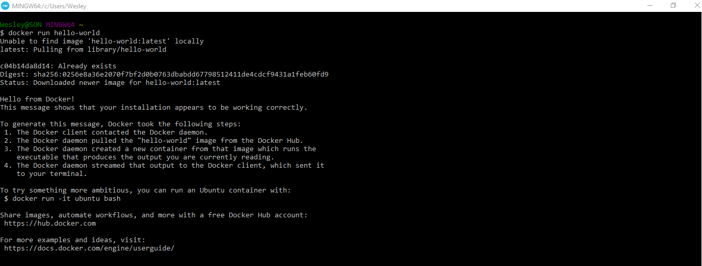

# Fazendo hello world e comandos básicos

Não é nosso objetivo criar um módulo só com os mais diversos comandos do Docker, porque ficaria massante e talvez não entendessem ou guardassem o que é mais importante.

Portando vamos apresentando os comandos principais e explicando, para que nosso conteúdo seja mais aproveitado e assimilado por todos. Acreditamos ser melhor desta forma porque iremos utilizar dois recursos, super importantes, mais pra frente, que são:

1. Docker File
2. Docker Compose

Para entendermos a ideia e o objetivo destes arquivos, precisamos entender como funcionam os containers do Docker, como subir um novo container e outros comandos.

Portanto durante o processo com Docker, passaremos as ideias básicas e os comandos principais que iremos utilizar.

***

# Iniciando com Docker

Após finalizada a instalação e ter rodado o terminal para iniciar o Docker, já podemos começar com os primeiros comandos.

No terminal digite `$ docker` e já terá uma lista de comandos disponíveis. São tantos os comandos que talvez ninguém saiba todos, mas temos esta facilidade de consultar a hora que quisermos.

Portanto iremos lhe passar o necessário, para que possa trabalhar com o Docker, no seu dia-a-dia de desenvolvimento, tranquilamente.

Próximo comando que sugerimos, na sequência, seria o `$ docker version` que trará os seguintes dados:

Se analisarmos a imagem acima, veremos que possuem duas informações importante:

1. Client
2. Server

**Client:** São os dados de onde estamos rodando os comandos. (_nossa máquina_)

**Server:** São os dados de onde o Docker irá acessar a **_Docker Engine_** , os **_containers_** e de onde irá rodar todas as aplicações.

***

Um comando bem comum para início, e que serve como teste para ver se o nosso Docker está rodando corretamente é o `$ docker run hello-world`.

Este comando solicita que o Docker rode a **imagem hello-world**. Em breve falaremos mais sobre _imagens_, mas já adiantando, **imagem** é como se fosse um **snapshot** de uma aplicação, máquina ou configurações. E no caso deste comando, será realmente um Hello World, somente para testar nosso Docker.

Quando rodamos este comando, o Docker da uma mensagem de que não foi possível encontrar a **imagem** localmente, mas ele faz um **download**, e nos mostra a mensagem acima no terminal. Após isso, sabemos que está tudo ok, com nosso Docker, e já fizemos a nossa primeira impressão e subimos nosso primeiro container.

Caso rode novamente o mesmo comando, o Docker nos mostrará, diretamente, a imagem **Hello World**, porque já foi baixada anteriormente e agora ele a encontra localmente.

Caso queira saber quais imagens você já possui, localmente, basta rodar o comando `$ docker images` e terá o seguinte resultado:

***

## Docker PS

Existe um comando muito utilizado: `$ docker ps`:

Este comando é responsável por retornar todos os **containers**, que estão rodando em nosso Docker. Um comando muito importante, para nós, que iremos trabalhar diretamente com os _containers_.

Na imagem acima, você pode verificar, que não existe nenhum container listado, porque ainda não ativamos nenhum.

Para visualizar todos os containers existentes, inclusive os que não estão rodando, basta utilizar o comando: `$ docker ps -a`

Agora, pode verificar que foram criados os containers automaticamente, porém eles não estão rodando.

Analisando a listagem de containers, podemos verificar, que eles possuem as seguintes informações:

1. **Names:** Como não setamos nenhum nome às _imagens_, o Docker cria, automaticamente, o ID e o nome da imagem.
2. **Image:** Significa que foi baseado na imagem _hello-world_.
3. **Command:** Informa o comando que foi rodado pelo Docker internamente.
4. **Created:** Informa a data de criação.
5. **Status:** Informa quando este comando foi rodado.

Existem outros dados que a listagem trás, mas estas são as mais relevantes.

Cada vez que rodarmos um `$ docker run hello-world`, um container será criado, e listado, no comando `$ docker ps -a`, pois o Docker vai salvando os registro e ocorrências.

Caso você queira remover algum container, basta utilizar o comando `$ docker rm ID/Nome`. No lugar do **ID/Nome** você substitui pelo **ID ou Nome** do container desejado.

**Exemplo**

`$ docker rm 2b8d85aa21d6` - Estou utilizando um ID da imagem acima. Depois que eu rodar este comando, o container não será mais listado, pois será removido.

Caso queira remover uma imagem o comando é muito parecido:

`$ docker rmi ID/Nome`

***

# Lista de Comandos

Comando | Função
------------ | ------------
`$ docker` | Listar todos os comandos
`$ docker version` | Mostrar informações de versão **Client** e **Server**
`$ docker run image_name` | Rodar uma determinada imagem
`$ docker images` | Listar todas as imagens locais
`$ docker ps` | Listar todos os containers em execução
`$ docker ps -a` | Listar todos os containers existentes independente se está em execução ou não
`$ docker rm ID/Nome` | Remover um container existente, basta informar **nome ou ID** no comando
`$ docker rmi ID/Nome` | Remover uma imagem existente, basta informar **nome ou ID** no comando