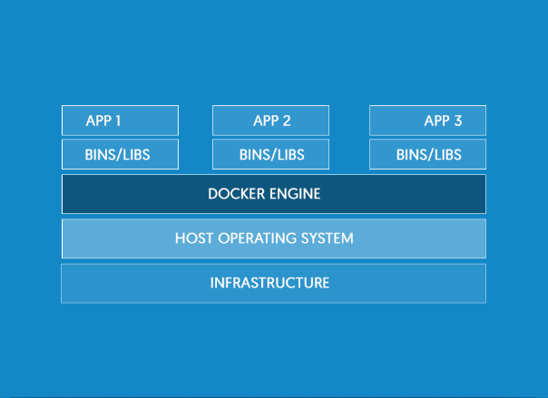

# O que é Docker?

Na introdução anterior falamos que o **Docker** é uma ferramenta maravilhosa que vem facilitando a vida dos desenvolvedores e assegurando que o mesmo ambiente seja utilizado para desenvolvimento, produção e qualquer outro terminal, de sua equipe, que pertença ao projeto.

Para entendermos melhor esta ferramenta podemos utilizar o próprio logo do Docker para fazermos uma analogia, pois, assim fica mais fácil de descobrir o real objetivo do _Docker_.

### Docker Engine

Na imagem acima a **_baleia_** seria uma pré-configuração ou a base de um ambiente de desenvolvimento que você pode levar para qualquer projeto e é conhecido também como **Docker Engine**.

 Isso significar que todos os membros da equipe teriam o mesmo padrão e os mesmos recursos, facilitando assim o desenvolvimento e evitando erros de diferentes sistemas operacionais.

### Containers

As **_caixas_** ou **_containers_** em cima da **_baleia_** seriam fragmentos ou instâncias necessárias para o desenvolvimento do projeto.

**_Exemplos_**

1. _Mysql_
2. _Apache/Nginx_
3. _PHP-FPM_
4. _Redis_
5. _ELASTICSEARCH_

Estes containers rodam de forma isolada, mas podem ter uma comunicação entre eles.

O mais interessante é que estes containers possuem **somente** o necessário para serem rodados. Em outras palavras somentes pedaços de códigos extremamente necessários para o funcionamento correto dos mesmos. Desta forma eu posso utilizar o kernel de um sistema operacional, sem precisar instalar o sistema operacional completo.

Vale a pena ressaltar que não existe um limite de containers para serem adicionados em sua **Docker Engine**, pois, como não tem um sistema operacional rodando junto com eles, os containers se tornam muito leves e esta é, sem dúvida, uma grande vantagem de utilizar o **Docker** além da padronização do seu ambiente de desenvolvimento e a praticidade de subir um servidor.

**_Veja um exemplo abaixo:_**

Conforme imagem acima, podemos verificar que o sistema possui um **kernel** comum para toda aplicação, mas depois disso exitem vários containers.

**Exemplos**

1. Debian image
2. Apache image
3. PHP-FPM
4. Redis
5. ELASTICSEARCH

O mais interessante, é que o Debian não está instalado como uma _máquina virtual_ sendo um sistema operacional completo. Neste _container_ Debian está somente o que é necessário para ele e os outros _containers_ citados na imagem. Por este motivo os containers são extremamente leves. **_O desnecessário é descartado._** E tudo que for comum entre os containers será reapoveitado, sem duplicação de código.

É possível criar vários tipos de **Dockers** e, de acordo com o que precisarmos, podemos adicionar os containers a eles.

Neste curso iremos aprender a criar containers fácilmente. Vamos aprender também a subir, rapidamente, um ambiente de desenvolvimento utilizando o **Docker**.

Você ficará maravilhado em saber o quanto é simples fazer tudo isso e vai querer dar adeus às antigas e trabalhosas práticas de desenvolvimento onde você tinha que ter muito espaço em disco e uma máquina para cada projeto que fosse desenvolver.

### Diferença entre Máquinas Virtuais e Containers com Docker Engine

Máquinas virtuais | Containers
------------ | -------------
 | 

#### Máquinas Virtuais
Podemos ver que quando utilizamos máquinas virtuais precisamos da instalação **completa** de um sistema operacional para cada aplicação em desenvolvimento, gerenciadas através do **HYPERVISOR** responsável pela virtualização de suas diversas máquinas.

Este processo utiliza muito espaço em seu disco local e exige muito de sua máquina principal porque está rodando um sistema operacional em cima de outro.

#### Containers

Com **Docker** utilizando **containers** tudo fica mais simples e fácil.

O gerenciador de ambiente de desenvolvimento deixa de ser o _HYPERVISOR_ e passa a ser o **_DOCKER ENGINE_** que não utiliza espaço nenhum a mais em sua máquina, pois ele utiliza o próprio sistema operacional da máquina principal sem virtualização nenhuma. E em ambos os processos conseguimos ter o mesmo ambiente de desenvolvimento. **Não é maravilhoso utilizar o Docker?**

**Resumo:** Conseguimos criar uma infinidade de containers dentro de uma mesma máquina compartilhando dados entre eles e ainda de uma forma extremamente leve e segura utilizando **containers**.

#### Objetivo da Aula

O nosso objetivo principal nesta aula é mostra, a você aluno, a **diferença** que existe entre **máquinas virtuais** e **containers**.

Apesar de ser muito vantajoso e prático utilizar o **Docker** não quer dizer que não precise utilizar mais as **máquinas virtuais**, mas agora você pode adequar seus projetos de acordo com suas necessidades e recursos.

#### Aprofundamento

Neste eBook encontrará um conteúdo bem técnico, mas caso queira se aprofundar no assunto é muito válido e indicado a leitura do mesmo.

