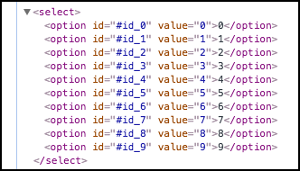

# Interagindo com o DOM - HTML

Para iniciar este conteúdo iremos dar continuidade ao exemplo anterior.

```html
<div id="bg" style="width:200px; height:200px; background: #000" onmouseover="over(this)">
        <h2 style="text-align: center; color:#fff">Over me</h2>
        <h2 style="text-align: center; color:#fff">Now</h2>
</div>
```

A diferença agora é que estamos passando o **this**, como argumento, para a função **over()**. Desta forma conseguimos dar uma assinatura para a função e resgatar o elemento, em questão, dentro da função para que possamos alterar. Este this informa à função que é deste elemento que estamos falando.

```javascript
function over(obj) {
    obj.innerHTML = '<h2 style="text-align: center; color:#fff">Over me JS</h2>;'
}
```

Pronto! Agora quando passar o mouse sobre o quadrado preto vamos conseguir alterar o conteúdo da div. Isso porque passamos o objeto referente a ela, como parâmetro para função.

Fiquem atentos que a função **innerHTML** altera todo conteúdo da div. Reparem que no HTML original temos duas tags h2 e quando passamos o mouse sobre a div passamos a ter somente um. Isso acontece porque na função passamos apenas um h2.

Fizemos isso para mostrar que o innerHTML remove todo conteúdo anterior e insere o novo conteúdo que passar. Portanto se tiver alguma característica, anterior, que deva ser mantida, você deverá passar para a função também.

Faça o teste em seu navegador para ver a mágica acontecendo.

# Criando elementos com javascript - INPUT

Primeiro iremos criar elementos input, de acordo com o número de campos solicitados:

```html
<input type="number" id="val" class="number_val_input">
<button id="generate_btn">Generate</button>
```

Inserimos um campo de input onde o usuário irá informar quantos campos deseja criar, depois basta clicar no botão Generate para que sejam gerados os campos.

```javascript
var input = document.getElementsByClassName('number_val_input');
var btn_generate = document.getElementById('generate_btn');
btn_generate.addEventListener('click',generate);

function generate() {
    var value = input[0].value;

    for(var i = 0; i < parseInt(value); i++ ){
            var inpt = document.createElement('input');
            inpt.id = "#btn_" + i;

            var body = document.getElementsByTagName('body');
            body[0].appendChild(inpt);
    }

}
```

Reparem que primeiro pegamos o valor digitado pelo usuário através da classe do elemento.

`var input = document.getElementsByClassName('number_val_input');`

Depois pegamos o botão pelo id e já adicionamos um evento ao clicar.

```javascript
var btn_generate = document.getElementById('generate_btn');
btn_generate.addEventListener('click',generate);
```

E por último nós criamos uma função, que será chamada pelo evento. Esta função faz um loop for de acordo com o número de repetições escolhidas pelo usuário.

Criamos um elemento input e setamos o id para cada iteração.

```javascript
var inpt = document.createElement('input');
inpt.id = "#btn_" + i;
```

Depois pegamos o elemento body do HTML para localizar onde iremos adicionar os campos. E logo depois adicionamos os elementos com a função **appendChild**.

```javascript
var body = document.getElementsByTagName('body');
body[0].appendChild(inpt);
```

Perceba que utilizamos o índice na variável body, porque a função **getElementsByTagName** nos retorna um array, então devemos informar o índice para que possamos inserir corretamente.

E pronto! Pode fazer o teste em seu navegador que os campos serão criados de acordo com o número informado.

# Criando elementos com javascript - SELECT

```javascript
// Criando select populado
var body1 = document.getElementsByTagName('body');
var select = document.createElement('select');
body1[0].appendChild(select);

for(var i = 0; i < 10; i++ ){
    var option = document.createElement('option');
    option.id = "#id_" + i;
    option.value = i;
    option.innerHTML = i;

    select.appendChild(option);
}
```

Para criar um elemento select já populado, temos uma lógica bem parecida. Primeiro pegamos o elemento body, para informar onde iremos adicionar. Depois criamos o elemento select.

O próximo passo é fazer uma iteração para conseguir formar os elementos **option**, onde passamos 10 repetições para o **for**.

Isso quer dizer que vamos ter 10 opções dentro do elemento select. Atribuímos todos os atributos e valores para o option, dinâmicamente, e adicionamos ao select utilizando o **appendChild**.

Então na ordem temos o elemento select sendo adicionado ao body1.

```javascript
var body1 = document.getElementsByTagName('body');
var select = document.createElement('select');
body1[0].appendChild(select);
```

E depois os elementos **option** sendo adicionados ao elemento select, que já foi adicionado.

```javascript
for(var i = 0; i < 10; i++ ){
    var option = document.createElement('option');
    option.id = "#id_" + i;
    option.value = i;
    option.innerHTML = i;

    select.appendChild(option);
}
```

Veja o resultado no HTML.



# Conclusão

Agora vocês puderam ver como trabalhamos com os elementos HTML junto com estruturas de repetições.

Vejam como as coisas vão se encaixando e os assuntos vão se cruzando. Agora faça bastante teste para que possa fixar os conceitos e vamos ao próximo assunto.