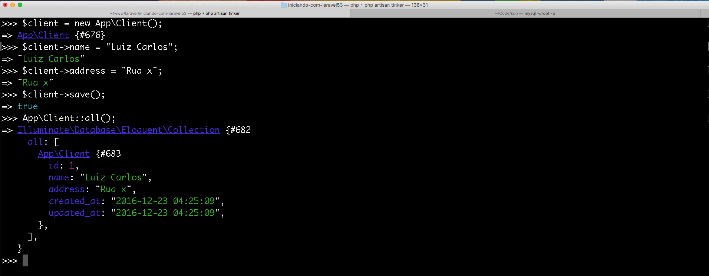

# Artisan tinker

No Laravel existe também um terminal interativo que nos possibilita rodar nossa aplicação no terminal, sem que precisemos ir toda hora no browser. Existem coisas que valem mais a pena fazer pelo famoso **tinker** do que ir até o browser.

O tinker faz parte de uma categoria de software chamado **repl**: read eval print loop. Esta característica que irá possibilitar a interação com a aplicação.

O tinker utiliza uma biblioteca Psy que irá pegar o boot, que temos em nossa aplicação, presente no index.php e irá rodar a aplicação. Dai pra frente podemos fazer o que quisermos via console.

# Iniciando com tinker

O comando para iniciar o tinker é o seguinte:

`$ php artisan tinker`

Depois de rodar este comando você poderá fazer o que quiser dentro da aplicação. Neste terminal é possível rodar qualquer instrução php. O objetivo inicial é brincar com o modelo que criamos.

Nós já criamos o banco de dados e também o modelo Client. Era pra estar tudo pronto para conseguirmos incluir dados em nossa tabela. Será que isso é possível?

SIm, é possível e iremos mostrar os passos para que possa criar os dados através do tinker: Veja abaixo:

# Criando primeiro registro

Vamos explicar a imagem acima de forma ordenada:

1. Criamos uma variável chamada client e atribuímos uma instância do modelo Client. Repare que, no tinker, você deve passar o namespace para que ele consiga localizar o seu modelo.
2. Atribuímos, ao campo nome, o valor de Luiz Carlos.
3. Atribuímos ao campo address, o valor de Rua x.
4. Depois de alimentar os campos, do objeto $client, bastou que executasse o método **save**, para concluir a inserção no banco de dados. Antes deste comando **save()** tínhamos apenas uma instância e mais nada. Porém depois que salvamos o Eloquent pegou os dados do objeto e se encarregou de salvar os dados no banco. Reparem que o tinker retornou true, isso quer dizer que foi salvo com sucesso.
5. Utilizamos um método que se chama **all()** que é do próprio Eloquent. Ele lista todos os elementos da tabela. Então pudemos concluir que os dados realmente foram salvos. Caso queira pode acessar o banco de dados e fazer um select para confirmar.

Reparem que os campos **timestamp** created_at e updated_at, que são criados pelo próprio framework,  foram preenchidos automaticamente.

O tinker tem o objetivo de nos auxiliar no desenvolvimento. Com ele podemos testar nossa aplicação. Podemos testar também os relacionamentos entre tabelas, tudo isso sem precisar do auxílio do browser.

Caso queiramos atualizar um dado no tinker podemos fazer desta forma:

Reparem que primeiro imprimimos o valor das variáveis, para que pudessem saber que é possível e também saber o valor atual. Depois atribuímos um novo valor para **name** e depois salvamos. Ao listar os dados novamente você pode conferir, na imagem, que o nome realmente foi alterado e também o campo **updated_at**. Para você reparar que, cada vez que for atualizado, este campo será modificado. Isso pode ser muito importante dependendo o projeto.

# Pesquisando registro por id

Já falamos sobre o método all do Eloquent, que é responsável por listar todos os dados da tabela. Agora vamos falar de outro método que busca um elemento pelo identificador único.

Repare que utiliza o mesmo modelo da facade all, porém o comando agora é find. Este método recebe um parâmetro, que será um número inteiro, no exemplo o id. Primeiro pesquisamos um elemento que existe e depois um elemento que não existe para que pudesse ver a diferença. Quando encontra um id retorna um objeto, mas quando não encontra o Eloquent retorna null.

Por enquanto estamos vendo como é fácil listar todos os dados, buscar um elemento por id, incluir e atualizar dados em nossa tabela e até mesmo saber se um elemento existe ou não. Tudo isso se torna muito fácil com o tinker. Temos a possibilidade de deletar um registro do banco de dados também.

# Deletando registro

Primeiro temos que atribuir um objeto a uma variável, utilizando o find, com o id que deseja deletar. Depois que temos um objeto basta que executemos o método delete dele. Assim ele irá apagar aquele registro, simples assim. Percebam que logo após a remoção, nós pesquisamos por id e já retornou null e quando listamos todos retornou uma coleção vazia.

Se acostumem com esta coleção de dados ao trabalhar com o Laravel, porque sempre trabalharemos com esta coleção. Ela nos permite gerenciar todo nosso array de itens que é retornado do banco de dados. Se retornou um array vazio quer dizer que realmente não temos mais nenhum dado em nossa tabela e isso quer dizer que tivemos exito em nossa exclusão.

Caso queira, você pode praticar, e cadastrar, um novo cliente do mesmo jeito que foi criado no início deste conteúdo, depois disse pode utilizar o comando all e verá que seu elemento fará parte da tabela novamente.