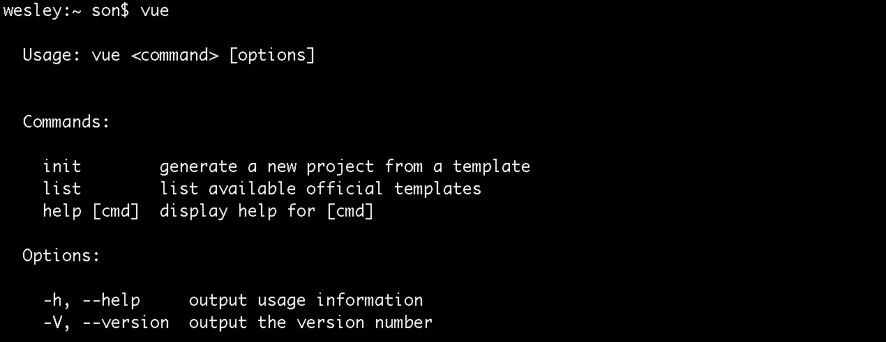
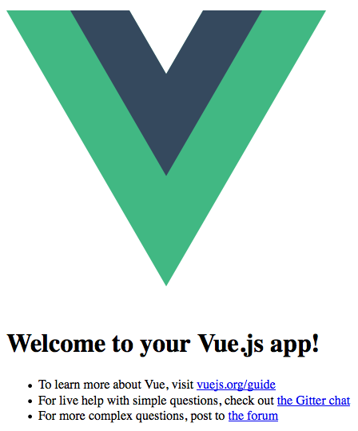

# Vue-cli

Vamos iniciar falando um pouco de **Node Js e Vue-cli**.

Para que consigamos rodar o node js, na versão 1 ou 2, em nossa máquina, nós não precisamos de nada, basta que a gente baixe o arquivo javascript do node, e já conseguiremos criar nossa aplicação.

Podemos também puxar o código online de alguma **cdn**, mas nós queremos lhe orientar a ter uma outra visão ao construir uma aplicação front-end.

Queremos que vocês passem a desenvolver com um ambiente diferente e mais estruturado. Pensando, sempre, em **módulos javascript** e também já visualizando **web apps**.

Então iremos utilizar uma ferramenta, chamada Vue-cli, que irá gerar uma aplicação, baseada no Vue.js, pra gente. Precisaremos do **Node** instalado em nossa máquina.
 
***

**Acesse:** (https://nodejs.org/en/) para download.

Atualmente existem duas versões disponíveis:

* **v6.9.2 LTS**
* **v7.2.1 Current**

Como vimos na imagem, é recomendado instalar a versão **LTS**. Porém você pode escolher com qual trabalhar.

O node, para quem não sabe, é uma ferramenta contruída em **Javascript** e nos possibilita rodar Javascript ao lado do servidor. Ele possibilita a criação de aplicações, inteiras, no back-end e também a criação de ferramentas para rodar em terminais.

É impossível escrever tudo que o Node é capaz em poucas palavras. Seria necessário um livro inteiro para falar dele. Então vamos processeguir.

***

### Instalando Node

Para Windows e Mac basta fazer o download e instalar normalmente utilizando o instalador. No Linux basta fazer a instalação pelo terminal, porém no site também informa como proceder.

Após instalação, basta ir até o terminal e rodar os comandos abaixo:

1. `$ node -v`
2. `$ npm -v`

Quando instalamos o Node, automaticamente, instalamos também o gerenciador de pacotes, chamado **NPM**.

***

Tendo instalado o **Node** iremos focar em nossa ferramenta **vue-cli**, que é uma ferramenta, desenvolvida em Node, para a criação de uma estrutura básica do nosso **Vue Js**.

O interessante desta ferramenta é que podemos tanto gerar uma aplicação básica de Vue, puxando os arquivos de uma **CDN**, quanto podemos trabalhar em aplicações mais complexas junto com **webpack e browserify**. Pode contar também com a facilidade de ter vários templates, que servem de exemplo, para que vocês possam começar a trabalhar.

***

> ### Então vamos a instalação do vue-cli

`Link: (https://github.com/vuejs/vue-cli)`

`$ npm install -g vue-cli`

_Observação:_ Para quem utiliza o Windows, é recomendado que instale o **git bash**, para que possa ser instalado mais fácilmente, via terminal, e também para que tenha uma experiência melhor.

Lembrando que você deve rodar o comando de instalação como usuário **root** ou **administrador** no caso de Windows.

***

> ### Verificando instalação

Digite o comando: `$ vue`

Caso esteja instalado terá a seguinte imagem, contendo os seguintes comandos:

***

# Utilizando Vue-cli

Para iniciarmos um projeto, após instalado o vue-cli, temos o seguinte comando, com dois parâmetros:

`$ vue init <template-name> <project-name>`

1. Nome do template
2. Caminho da pasta seguido do nome do projeto

Para sabermos quais templates existem basta rodar o seguinte comando:

`$ vue init <template-name> <project-name>`

É muito importante que tenha conhecimento de **webpack**, antes de se aventurar com templates de webpack, listados na imagem acima.

Iremos utilizar, como base, o template **simple**. Portanto iremos rodar o comando abaixo:

`$ vue init simple vue-simple`

O **vue-cli** irá gerar o projeto inicial para nós, com as configurações básicas. 

Serão feitas algumas perguntas, durante a instalação, que são informações importantes para a geração do arquivo **package.json**. Porém, no template **simple**, será criado apenas um arquivo **index.html**, não havendo assim, a necessidade de informar nenhum dado para estas perguntas. 

No caso dos outros templates deverão ser preenchidas estas informações que serão importante.

Como informado acima, o arquivo **index.html** é criado com toda configuração necessária para sair desenvolvendo o restante do seu projeto com **Vue Js**.

Após rodado o comando e criado o projeto temos a seguinte visão no browser:

Abra o arquivo **index.html**, em algum editor, para que possa analisar como é feita a inclusão do **Vue Js** via **CDN** e também toda configuração inicial. É muito importante que entenda como o Vue funciona.

Outra maneira de termos certeza de que o Vue foi carregado e está funcionando é abrindo o **Developer Tolls**, do seu navegador, e ir na aba **console**, lá existirá uma mensagem do **Vue**.

Apesar de termos usado, como exemplo, o **Template Simple**, não iremos utilizá-lo. Vamos prosseguir com o template de **webpack**, portanto, caso não conheça o webpack, é extremamente importante que estude, antes de continuar a leitura dos próximos capítulos.
