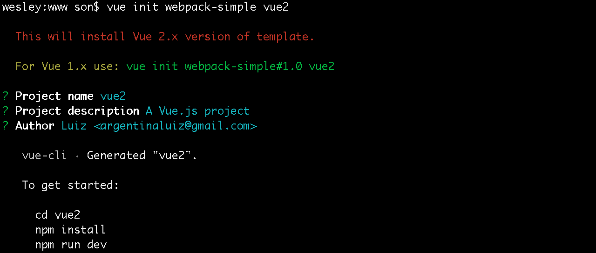
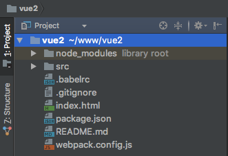

# Criando projeto com webpack-simple

Iremos instalar o nosso novo projeto, que se chamará **vue2** e utilizaremos o template **webpack-simple**. O comando que iremos rodar será o seguinte:

`$ vue init webpack-simple vue2`

Note que não informamos nenhum caminho de pasta para nosso projeto. Desta maneira, o projeto será criado na pasta que estiver o nosso terminal.

Assim como no template simple, serão feitas algumas perguntas antes de gerar nosso projeto. Neste caso será importante informar.



O comando anterior não gera o projeto diretamente. Porém ele cria o arquivo **package.json** com as dependência que precisaremos para utilizar este template.

```json
{
  "name": "vue2",
  "description": "A Vue.js project",
  "version": "1.0.0",
  "author": "Luiz <argentinaluiz@gmail.com>",
  "private": true,
  "scripts": {
    "dev": "cross-env NODE_ENV=development webpack-dev-server --open --inline --hot",
    "build": "cross-env NODE_ENV=production webpack --progress --hide-modules"
  },
  "dependencies": {
    "vue": "^2.1.0"
  },
  "devDependencies": {
    "babel-core": "^6.0.0",
    "babel-loader": "^6.0.0",
    "babel-preset-es2015": "^6.0.0",
    "cross-env": "^3.0.0",
    "css-loader": "^0.25.0",
    "file-loader": "^0.9.0",
    "vue-loader": "^10.0.0",
    "vue-template-compiler": "^2.1.0",
    "webpack": "^2.1.0-beta.25",
    "webpack-dev-server": "^2.1.0-beta.0"
  }
}
```

À partir deste arquivo, podemos dar início ao nosso projeto facilmente, rodando somente um comando.

***

# Instalando dependências

Precisaremos instalar todas as dependências listadas no arquivo **package.json**. Para isso iremos rodar o seguinte comando:

`$ npm install`

Este comando é capaz de instalar tudo muito rapidamente, dependendo da velocidade da sua internet. Ele cria uma pasta chamada **node_modules**, em sua pasta raiz, onde ficarão armazenandos todos os arquivos pertencentes às dependências instaladas.

O **vue-cli** cria a estrutura completa do projeto, inclusive o arquivo **.gitignore** com a pasta **node_modules** adicionada, para que a mesma não faça parte do seu controle de versões.

### Estrutura do projeto

Veja a estrutura criada, pelo **vue-cli**, lembrando que a pasta **node_modules** foi criada somente após o comando `$ npm install`.



Diretório/Arquivo | Função
-------------------- | -----------
**node_modules** | Pasta criada à partir do comando `npm install` que armazena todos os arquivos pertencentes às dependências instaladas em seu projeto
**src** | Pasta responsável por armazenar os arquivos do projeto
**.babelrc** | Arquivo de configuração necessário para informar para qual versão de nossa ECMAScript será compilado nosso código. No nosso caso da ES6 para ES5. Lembrando que isso é necessário porque nem todos os browsers são compatíveis com a ES6
**.gitignore** | Arquivo que ignora os itens para nosso controle de versão
**index.html** | Arquivo inicial do projeto
**package.json** | Arquivo com todas informações e dependências do nosso projeto
**README.md** | Arquivo de instruções sobre a aplicação
**webpack.config.js** | Arquivo de configuração do **webpack**

Obs: É interessante que seja adicionado, além dos que já são adicionados automaticamente, a pasta **.idea** no arquivo **.gitignore**. Deste modo o conteúdo do arquivo ficaria assim:

```
.DS_Store
node_modules/
dist/
npm-debug.log
.idea/
```

Desta forma nosso projeto está devidamente instalado e pronto para iníciarmos os nossos trabalhos com o **Vue**.