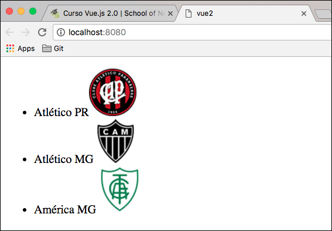
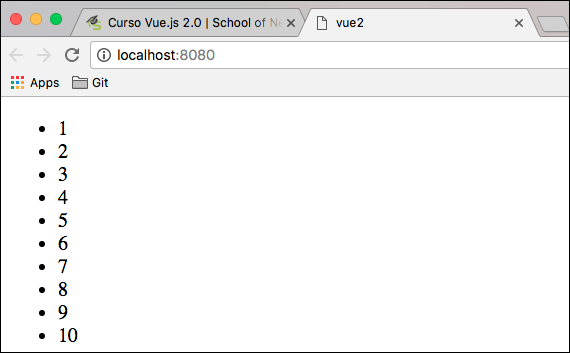

# Lidando com coleções - v-for

Para mostrarmos uma **coleção de dados** de uma só vez podemos utilizar os recursos que o Vue.js nos proporciona.

Existe uma diretiva do Vue que manipula o HTML. Na verdade ela replica o código HTML quantas vezes forem necessárias a partir do número de itens que existem na coleção. Quando falamos de coleção estamos falando de um **array**, ou seja, quando temos dados agrupados.

Para darmos início a nosso exemplo, precisamos criar, dentro do **data**, um array com todos os times que quisermos listar. Veja abaixo:

```
    data: {
        times: [
            new Time('Atlético PR' , require('./assets/atletico-pr_60x60.png')),
            new Time('Atlético MG' , require('./assets/atletico_mg_60x60.png')),
            new Time('América MG' , require('./assets/america_mg_60x60.png'))
        ]
    }
```

E nosso HTML fica muito mais simples utilizando o famoso **v-for**:

```html
<ul>
    <li v-for="time in times">
        {{ time.nome }}
    </li>
</ul>
```

Basta nós escolhermos qual será o elemento que irá repetir. Neste nosso caso decidimos utilizar a estrutura de **lista** portanto nosso item repetidor é o **<li>**.

O **v-for** é uma estrutura de repetição onde o Vue reconhece que **times** é uma array, que foi declarado na instância Vue. Desta forma ele se encarrega de gerar o html quantas vezes forem necessárias à partir da quantidades de itens adicionados ao **array times**.

Caso informe algum valor que não exista ou não esteja declarado o próprio Vue nos reportará um erro. Trocaremos o nome do nosso array **times** para **times1**. Veja o erro reportado:


Por este motivo, não precisamos nos preocupar porque o Vue nos informará qualquer erro durante a renderização de nossa aplicação.

É extremamente aconselhado desenvolver sempre com o seu **developer tools** aberto para que possa ir acompanhando a sua aplicação e os possíveis e eventuais erros que possam ocorrer.

# v-for com números

Não precisamos, necessariamente, ter um array de objetos para listar usando **v-for**. Poderia ser um array de números ou até mesmo não existir array nenhum.

Veja um exemplo abaixo sem a existência de um array:

```html
<ul>
    <li v-for="x in 10">{{ x }}</li>
</ul>
```

Desta forma teremos a listagem de 1 até 10 de uma forma muito simples e rápida.

# Visualizando exemplos de v-for

v-for (__times__) | v-for (__Números__)
------------------------ | -----------------------------
 | 

***


