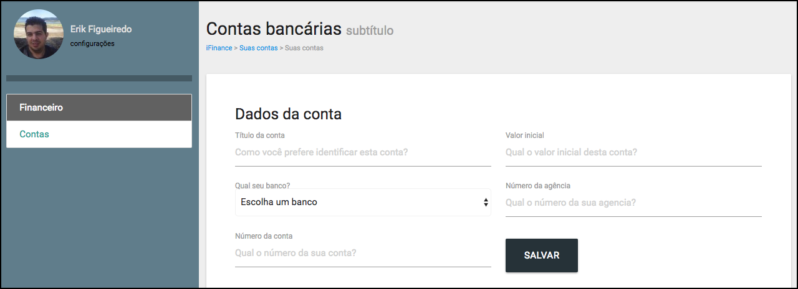

# Criando componente de edição e criação

Por enquanto temos nossas contas sendo listadas e a visualização individual de cada uma delas. Até então está tudo estruturado, porém sem nenhuma funcionalidade ainda.

No módulo passado ficou pendente a edição e a criação de uma nova conta, pois os botões **Editar** e o **Nova Conta** não nos direciona para lugar algum.

Neste módulo faremos este direcionamento e criaremos estes dois componetes, para que não fiquemos sem navegação em nosso projeto. Depois de tudo estruturado iremos começar a aplicar as lógicas e trazer os dados de outro local. Por enquanto pode verificar que está tudo manual, apenas para ilustrar.

# Componente Nova Conta

### Template

Neste componente não teremos o bloco de template, porque iremos carregar o formulário, de criação, de um outro arquivo.

Para isso crie um arquivo chamado form.html dentro da pasta **Accounts** com o seguinte conteúdo:

```html
<div class="row">
    <div class="content-header">
        <h1>Contas bancárias <small>editando/adicionando</small></h1>
        <div class="grey-text">
            <small>
                <a href="#/">iFinance</a> >
                <a href="#/contas">Suas contas</a> >
                <span>Suas contas</span>
            </small>
        </div>
    </div>
    <div class="card col s12">
        <div class="card-content">
            <form class="row" autocomplete="off">
                <div class="input-field col s12">
                    <h5>Dados da conta</h5>
                </div>
                <div class="input-field col s6">
                    <input type="text" id="title" class="validate" placeholder="Como você prefere identificar esta conta?" required>
                    <label for="title" class="active">Título da conta</label>
                </div>
                <div class="input-field col s6">
                    <input type="text" id="balance_initial" class="validate" placeholder="Qual o valor inicial desta conta?" required>
                    <label for="title" class="active">Valor inicial</label>
                </div>
                <div class="input-field col s6">
                    <select class="browser-default">
                        <option value="0">Escolha um banco</option>
                        <option class="left circle">Banco (000)</option>
                    </select>
                    <label for="" class="active">Qual seu banco?</label>
                </div>
                <div class="input-field col s6">
                    <input type="number" id="agency" class="validate" placeholder="Qual o número da sua agencia?" required>
                    <label for="agency" class="active">Número da agência</label>
                </div>
                <div class="input-field col s6">
                    <input type="number" id="account_number" class="validate" placeholder="Qual o número da sua conta?" required>
                    <label for="accont_number" class="active">Número da conta</label>
                </div>
                <div class="input-field col s6">
                    <input type="submit"class="waves-effect waves-light btn-large blue-grey darken-4" value="salvar">
                </div>
            </form>
        </div>
        <div class="card-action">
            <a href="#/contas">Voltar</a>
        </div>
    </div>
</div>
```

Fizemos isso para que o conteúdo seja priorizado e para que não percamos tempo no desenvolvimento do formulário. Veja que nos scripts nós chamamos o código acima através de um **require**.

### Script

```js
export default {
  name: 'accounts-create',
  template: require('./form.html')
}
```

### Configurando Rota create

```js
import Hello from 'components/Hello'
import AccountsList from '../components/Accounts/List'
import AccountsCreate from '../components/Accounts/Create.vue'
import AccountsView from '../components/Accounts/View.vue'

const routes = [
  { path: '/', name: 'Hello', component: Hello },
  { path: '/contas', component: AccountsList },
  { path: '/contas/novo', component: AccountsCreate },
  { path: '/contas/:id', component: AccountsView }
]

export default routes
```

É muito importante seguir a ordem de rotas acima, porque se você adicionar a rota de criação depois da rota view, o VueRouter irá interpretar o **/novo** como sendo um **/id** na url e irá redirecionar para a rota view ao invés de carregar a rota create.

Faça o teste para você entender o que estamos falando depois retorne a rota no lugar correto.

Desta forma era para estar tudo funcionando corretamente, mas para que o **webpack** consiga carregar um html, precisamos instalar um loader específico, que se chama **html-loader** e depois configurá-lo no arquivo de configuração.

Já falamos que existem 3 tipos de arquivos de configurações: um só para desenvolvimento, outro só para produção e outro para ambos os ambientes.

Neste caso, como o formulário será carregado em ambos os ambientes deveremos configurá-lo no arquivo **webpack.base.config.js** que está na pasta **build**. Veja a configuração do loader que deverá ser feita:

```js
{
    test: /\.(html)$/,
    loader: 'html-loader',
}
```

Adicione esta configuração dentro da propriedade **module** e depois do último loader que estiver configurado. Este loader fará um teste em todos, caso tenha a extensão html ele aplica o loader e inclui o arquivo no empacotamento.

Depois de feita a configuração não se esqueça de parar o servidor em seu terminal de comando e instale o loader seguindo o comando abaixo:

`npm install html-loader --save`

Depois de todo este processo rode o comado de desenvolvemento novamente (`npm run dev`) para ver se não existe nenhum erro. Depois clique no botão **Nova Conta**. Você deverá ver o formulário conforma imagem abaixo:



Depois de ver o formulário funcionando podemos começar a trabalhar com modelo de dados e resgatar valores dinamicamente, através do vue, em nosso formulário. Para isso veja as alterações:

```js
export default {
  name: 'account-create',
  data () {
    return {
      sub_title: 'Criando conta'
    }
  },
  template: require('./form.html')
}
```

Reparem que adicionamos a propriedade **data** que configuramos um dado chamado **sub_title**.

Agora precisamos recuperar este dado em nosso formulário utilizando a interpolação do Vue ( {{ }} ). Onde estiver encontrar o conteúdo **editando/adicionando** substitua por **{{ sub_title }}**. Desta forma o valor será carregado do nosso componente, assim você pode alterar este valor posteriormente sem mexer no template.

# Componente Nova Conta

Para agilizar o processo iremos duplicar o arquivo **Create.vue** e renometar para **Edit.vue**. Depois iremos alterar o conteúdo, que ficará assim:

```js
export default {
  name: 'account-edit',
  data () {
    return {
      sub_title: 'Editando conta'
    }
  },
  template: require('./form.html')
}
```

### Configurando rota edit

```js
import Hello from 'components/Hello'
import AccountsList from '../components/Accounts/List'
import AccountsCreate from '../components/Accounts/Create.vue'
import AccountsEdit from '../components/Accounts/Edit.vue'
import AccountsView from '../components/Accounts/View.vue'

const routes = [
  { path: '/', name: 'Hello', component: Hello },
  { path: '/contas', component: AccountsList },
  { path: '/contas/novo', component: AccountsCreate },
  { path: '/contas/:id', component: AccountsView },
  { path: '/contas/:id/editar', component: AccountsEdit }
]

export default routes
```

# Conclusão

Agora todos nossos componentes estão conectados e existe uma navegabilidade por todos eles. Desta forma só falta carregamos as informações do banco de dados, para ficar dinâmica a aplicação.

Faremos isso no próximo módulo.