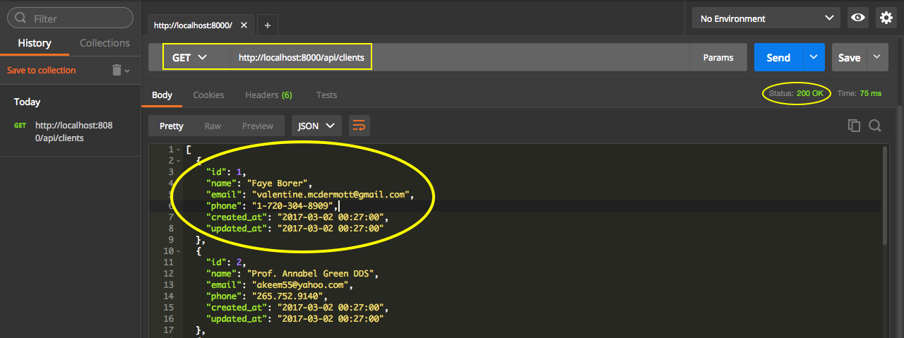

# REST - GET clients

Criaremos o primeiro recurso da aplicação RESTful.

Para isso teremos que acessar a pasta **app/http** e abrir o arquivo chamado **routes.php**. Algumas versões mais novas do Lumen e do Laravel já trazem a pasta Routes fora da pasta app. Então caso não encontre este arquivo no caminho informado procure fora da pasta app, uma pasta chamada **Routes**, na raiz do seu projeto. Neste último caso, entre na pasta Routes e abra o arquivo **web.php**. Na nova estrutura existe também um arquivo separado para APIs que você pode utilizar, mas falaremos em outros conteúdos mais atualizados e avançados. Por enquanto utilizaremos um destes dois arquivos para exemplificar.

Nestes arquivos podemos configurar os nossos **endpoints** e **rotas** da nossa aplicação. Quando falamos endpoints seria a mesma coisa que falar do recurso que será acessado externamente.

Por padrão temos a seguinte rota:

```php
$app->get('/', function () use ($app) {
    return $app->version();
});
```

Que seria a rota padrão do projeto atual. Esta rota retorna a versão do Lumen, por este motivo quando você iniciou o servidor embutido e acessou o browser teve a versão como conteúdo do arquivo.

Como teremos várias variações de recursos, em nossa API, iremos trabalhar com o modelo de grupos de rotas que o Lumen oferece. Com os grupos conseguimos organizar melhor os recursos/rotas da nossa API.

Veja abaixo:

```php
$app->group([
    'prefix' => 'api/clients',
    'namespace' => 'App\Http\Controllers'
], function () use ($app) {
    $app->get('','ClientsController@index');
});
```

No Laravel temos mais recursos para trabalhar com grupo de rotas porque podemos colocar todas as rotas dentro de um mesmo nível e trabalhar com subníveis dentro de uma mesmo prefixo. No Lumen não podemos trabalhar desta forma então teremos que criar grupo por grupo para utilizarção dos prefixos.

Lembrando, que no exemplo acima, o recurso é somente **clients** o api faz parte do domínio que deverá ser acessado para ter como resultado os dados do recurso.

Depois do prefixo configuramos o namespace que iremos trabalhar com os recursos. No nosso exemplo estamos passando o caminho da pasta de Controllers de nossa aplicação: **App\Http\Controllers**.

O próximo passo será importar a instância do **$app** para dentro do contexto da função, utilizando o **use**, e invocar o método get, que vai fazer uma requisição do tipo get para a API. Depois temos que informar algum valor a mais para complementar a rota, em nosso caso deixamos vazio o primeiro parâmetro, isso quer dizer que o usuário precisará acessar apenas **api/clients**, para ter o resultado dos clientes, depois passamos o nome do controler seguido do método que será executado, ao acessarem esta rota, ou recurso, como segundo parâmetro.

## Conteúdo do Controller

Dentro da pasta de Controllers, já citada acima, iremos criar o nosso controller chamado **ClientsController**. Lembrando que deve ter o mesmo nome que informamos para a rota do recurso acima.

```php
namespace App\Http\Controllers;

use App\Client;

class ClientsController extends Controller
{
    public function index()
    {
        return Client::all();
    }
}
```

Se estiver utilizando a versão mais atual do Lumen e Laravel você não deve utilizar o namespace para que não tenha erro na hora de retornar os dados. Basta remover ou comentar a linha. Veja abaixo:

```php
$app->group([
    'prefix' => '/api/clients',
    //'namespace' => 'App\Http\Controllers'
], function() use($app) {
    return $app->get('','ClientsController@index');
});
```

Desta forma já pode ir até seu browser e acessar o recurso que terá o resultado, de listagem dos clientes, em formato JSON, pois o Laravel já consegue converter o resultado para JSON automaticamente.

Para acessar o recurso acesse a seguinte URI: **http://localhost:8000/api/clients**. Lembrando que 8000 foi a porta que definimos no servidor embutido, se você utilizar outra porta, deverá alterar o endereço.

Mesmo tendo o resultado no browser, nós não indicamos o navegador para realização de testes em APIs. O mais indicado é instalar uma ferramenta para a realização destes teste. Nós iremos utilizar o **Postman**. Este recurso já tem uma extensão no Chrome para quem quiser instalar.

Com esta ferramenta você possui histórico de todas as suas requisições, opção de selecionar o verbo http que irá utilizar, consegue passar facilmente parâmetros além de conseguir enviar informações de headers específicos. É uma ferramenta maravilhosa que simula um ambiente perfeito para seus testes.

Veja, na imagem abaixo, o resultado da requisição utilizando o Postman:



Não estamos fazendo nenhuma alteração de dados, estamos apenas consultando os mesmos. Por este motivo dissemos, em módulos anteriores, que esta é uma requisição segura.